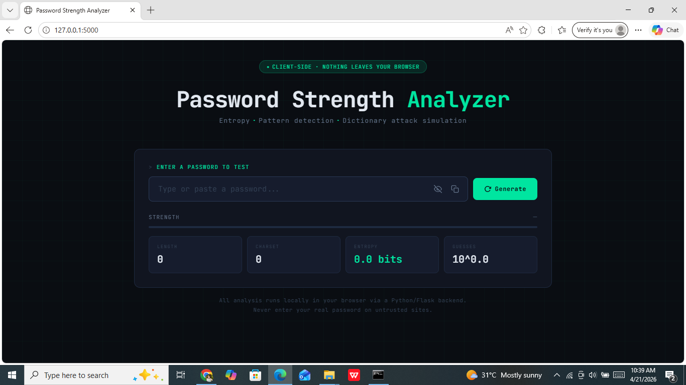
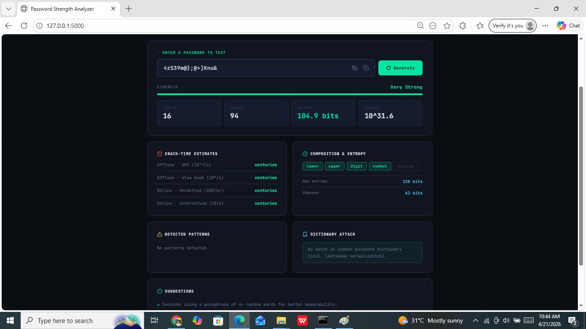

# 🔐 Password Strength Analyzer

<div align="center">


**A real-time, client-safe password strength analyzer built with Python & Flask.**  
Entropy calculation · Pattern detection · Dictionary attack simulation · Crack-time estimation



> ⚠️ **Privacy First** — All analysis is processed locally. Your password never leaves your machine.

</div>

---

## ✨ Features

| Feature | Description |
|--------|-------------|
| 📊 **Entropy Analysis** | Calculates real bit-level entropy based on charset size and password length |
| 💪 **Strength Rating** | 5-level rating: Very Weak → Weak → Fair → Strong → Very Strong |
| ⏱️ **Crack-time Estimates** | Simulates 4 real-world attack scenarios (online throttled → GPU offline) |
| 🔍 **Pattern Detection** | Detects keyboard walks, repeated chars, sequences, date patterns & leet speak |
| 📖 **Dictionary Attack Sim** | Checks against common passwords including leet speak normalization |
| 🧮 **Shannon Entropy** | Displays both raw and Shannon entropy for deep analysis |
| 💡 **Smart Suggestions** | Actionable tips to make your password stronger |
| ⚡ **Password Generator** | Generates cryptographically strong random passwords |
| 👁️ **Show / Hide & Copy** | Toggle visibility and copy to clipboard with one click |

---

## 📸 Screenshots

<table>
  <tr>
    <td align="center"><b>Home Screen</b></td>
    <td align="center"><b>Analysis Results</b></td>
  </tr>
  <tr>
    <td></td>
    <td></td>
  </tr>
</table>

---

## 🚀 Getting Started

### Prerequisites

- Python 3.7 or higher
- pip

### Installation

**1. Clone the repository**
```bash
git clone https://github.com/hansana1213/password-strength-analyzer.git
cd password-strength-analyzer
```

**2. Create a virtual environment** *(recommended)*
```bash
python -m venv venv
```

Activate it:
- **Windows:** `venv\Scripts\activate`
- **Mac/Linux:** `source venv/bin/activate`

**3. Install dependencies**
```bash
pip install -r requirements.txt
```

**4. Run the app**
```bash
python app.py
```

**5. Open in your browser**
```
http://localhost:5000
```

---

## 📁 Project Structure

```
password-strength-analyzer/
│
├── app.py                  # Flask backend — all analysis logic
├── requirements.txt        # Python dependencies
├── README.md               # Project documentation
│
└── templates/
    └── index.html          # Frontend UI (HTML + CSS + JS)
```

---

## 🧠 How It Works

### Entropy Calculation
```
Entropy = length × log₂(charset_size)
```
The charset size grows as more character types are used (lowercase, uppercase, digits, symbols, unicode).

### Strength Score
Effective entropy is calculated after applying penalties for detected patterns:

```
Effective Entropy = Raw Entropy − Pattern Penalties
```

| Effective Entropy | Strength |
|------------------|----------|
| < 28 bits | Very Weak |
| 28 – 35 bits | Weak |
| 36 – 49 bits | Fair |
| 50 – 63 bits | Strong |
| 64+ bits | Very Strong |

### Crack-time Scenarios

| Scenario | Speed |
|---------|-------|
| Online · throttled | 100 guesses/hr |
| Online · unthrottled | 10 guesses/sec |
| Offline · slow hash | 10,000 guesses/sec |
| Offline · GPU | 10,000,000,000 guesses/sec |

### Pattern Detection
- **Keyboard walks** — uses a keyboard adjacency graph (e.g., `qwerty`, `asdf`)
- **Repeated characters** — detects runs like `aaa`, `111`
- **Sequential characters** — detects `abc`, `123`, `xyz`
- **Date-like segments** — detects years, month numbers
- **Leet speak** — normalizes `@→a`, `3→e`, `0→o`, `5→s` and checks against dictionary

---

## 🛠️ Tech Stack

- **Backend:** Python, Flask
- **Frontend:** HTML5, CSS3, Vanilla JavaScript
- **Fonts:** JetBrains Mono, Space Grotesk
- **Analysis:** Pure Python (math, re, string, random)

---

## 📡 API Endpoints

### `POST /analyze`
Analyzes a password and returns full security report.

**Request:**
```json
{
  "password": "MyP@ssw0rd!"
}
```

**Response:**
```json
{
  "length": 11,
  "charset": 94,
  "entropy": 72.1,
  "guesses_exp": 21.7,
  "strength_score": 4,
  "strength_label": "Very Strong",
  "crack_times": {
    "Online · throttled (100/hr)": "centuries",
    "Online · unthrottled (10/s)": "centuries",
    "Offline · slow hash (10⁴/s)": "centuries",
    "Offline · GPU (10¹⁰/s)": "centuries"
  },
  "composition": {
    "lower": true,
    "upper": true,
    "digit": true,
    "symbol": true,
    "unicode": false
  },
  "patterns": [],
  "dictionary": {
    "found": false,
    "message": "No match in common password dictionary."
  },
  "suggestions": []
}
```

### `GET /generate`
Generates a strong random password.

**Response:**
```json
{
  "password": "?s=cE{5e#E%f!2sc"
}
```

---

## 🔒 Privacy & Security

- ✅ All password analysis runs **server-side on your local machine**
- ✅ No passwords are logged, stored, or transmitted to any external server
- ✅ No third-party analytics or tracking
- ✅ Safe to use in offline environments

---

## 🤝 Contributing

Contributions are welcome! Here's how:

1. Fork the repository
2. Create a new branch: `git checkout -b feature/your-feature-name`
3. Make your changes and commit: `git commit -m "Add your feature"`
4. Push to the branch: `git push origin feature/your-feature-name`
5. Open a Pull Request

### Ideas for Contributions
- [ ] Add more common passwords to the dictionary
- [ ] Support for passphrase strength analysis
- [ ] Dark/light theme toggle
- [ ] Password history comparison
- [ ] Export analysis as PDF report

---

## 📄 License

This project is licensed under the **MIT License** — see the [LICENSE](LICENSE) file for details.

---

## 👨‍💻 Author

**Darshika Madhuhansani**  
🎓 Computer Science Student | Cybersecurity Enthusiast  
📍 University of Vavuniya, Sri Lanka

[](https://www.linkedin.com/in/darshika-madhuhansani-266397349)
[](https://github.com/hansana1213)

---

<div align="center">

⭐ **If you found this project helpful, please give it a star!** ⭐

*Built with ❤️ and Python*

</div>
